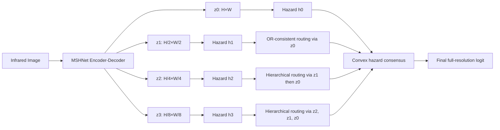

# OHR-MSHNet：面向 AAAI-27 的 MSHNet 单点结构改进方案

> **STATUS: RETRACTED / FINAL NO-GO（2026-07-12）**
> **原因：side SLS 输出不具备已识别的 block-occupancy 概率语义；noisy-OR
> 假设与实际 MSHNet 推理图不一致；Gate D/G0 证据不支持 final-fusion 或
> component-conversion 作为统一根因。本文仅作为历史设计记录保留，不实现、
> 不训练、不进入消融表。**
> **原文状态：主方案冻结版 v1.0（已撤回）**
> **Baseline：MSHNet（CVPR 2024）**  
> **主模型：OHR-MSHNet（OR-Consistent Hazard Routing MSHNet）**  
> **论文暂定题目：From Coarse Occupancy to Pixel Evidence: OR-Consistent Hazard Routing for Infrared Small Target Detection**  
> **结论：不再叠加 DEA、OMM、CCSR、注意力、Mamba、频域或额外损失模块；只替换 MSHNet 中存在明确语义缺陷的多尺度预测头。**

---

## 0. 最终决策

这次只做一件事：

> **把 MSHNet 的“粗尺度 logit 双线性上采样 + 四尺度拼接 + 无约束 3×3 卷积”替换为一个由侧监督语义严格推导出的、OR 一致的概率提升与融合机制。**

模型名称定为：

## **OHR-MSHNet**

其中 OHR 表示 **OR-Consistent Hazard Routing**，中文可称为：

## **逻辑或一致的风险量路由**

这不是在 MSHNet 后面再外挂一个模块，而是直接改掉 MSHNet 原有多尺度头中最不合理的运算定义。编码器、解码器、四个 `1×1` 侧输出头和原始 SLS 训练目标均保留，因此：

- 改动位置集中；
- 代码可以在一天内成型；
- 能直接加载 MSHNet 主干权重；
- 消融关系清楚；
- 论文主张可以由一个数学性质支撑，而不是靠模块堆叠；
- 与 2025—2026 年近期 IRSTD 模型的创新方向容易区分。

需要明确：任何新研究方案都不能预先保证审稿或指标“绝不失败”。本方案的目标是把风险压缩到一个可单元测试、可一天内否证、可直接回退的核心机制上，避免再次进入多分支、多损失、多超参数的无边界试错。

---

## 1. 截止时间与倒排目标

AAAI-27 官方时间为：

- 摘要截止：**2026 年 7 月 21 日 23:59，UTC−12（AoE）**；
- 全文截止：**2026 年 7 月 28 日 23:59，UTC−12**；
- 补充材料和代码截止：**2026 年 7 月 31 日 23:59，UTC−12**。

换算为台北时间（UTC+8）：

- 摘要实际本地截止：**2026 年 7 月 22 日 19:59**；
- 全文实际本地截止：**2026 年 7 月 29 日 19:59**；
- 补充材料和代码实际本地截止：**2026 年 8 月 1 日 19:59**。

当前目标不是立刻做完全部实验，而是：

1. **7 月 13 日前完成模型与单元测试；**
2. **7 月 14 日前获得短程实验方向性结果；**
3. **7 月 15 日冻结模型方程和名称；**
4. **7 月 19 日前形成摘要所需的核心结果、消融和可视化；**
5. **7 月 20 日冻结摘要。**

官方页面：<https://aaai.org/conference/aaai/aaai-27/>

---

# 2. 对当前 MSHNet 代码的结构审计

## 2.1 MSHNet 当前实际结构

仓库中的 `model/MSHNet.py` 使用一个 U-Net 式编码器—解码器：

- 通道数：`[16, 32, 64, 128, 256]`；
- 四次 `MaxPool2d(2, 2)` 下采样；
- 解码阶段使用双线性上采样；
- 在四个解码尺度上分别通过 `1×1 Conv` 输出单通道 logit：
  - `mask0`：原分辨率；
  - `mask1`：1/2 分辨率；
  - `mask2`：1/4 分辨率；
  - `mask3`：1/8 分辨率；
- 再把后三个输出双线性上采样到原分辨率；
- 拼接四个尺度；
- 用一个 `Conv2d(4, 1, 3, 1, 1)` 得到最终预测。

关键代码等价于：

```python
mask0 = self.output_0(x_d0)
mask1 = self.output_1(x_d1)
mask2 = self.output_2(x_d2)
mask3 = self.output_3(x_d3)

s0 = mask0
s1 = self.up(mask1)       # bilinear ×2
s2 = self.up_4(mask2)     # bilinear ×4
s3 = self.up_8(mask3)     # bilinear ×8

scale_logits = torch.cat([s0, s1, s2, s3], dim=1)
z_full = self.final(scale_logits)  # 4 -> 1, 3×3 convolution
```

对应源码：

- `model/MSHNet.py`：<https://github.com/Arialliy/DEA/blob/main/model/MSHNet.py>
- 原始 MSHNet 论文：<https://openaccess.thecvf.com/content/CVPR2024/html/Liu_Infrared_Small_Target_Detection_with_Scale_and_Location_Sensitivity_CVPR_2024_paper.html>

## 2.2 当前训练侧监督的真实语义

当前训练管线使用 `MaxPool2d(2, 2)` 递归生成不同尺度的侧监督标签。对二值标签而言，最大池化不是普通的“缩小图像”，而是一个严格的逻辑 OR：

\[
Y_{s+1}(u)=\max_{v\in\mathcal B(u)}Y_s(v)
          =\bigvee_{v\in\mathcal B(u)}Y_s(v),
\]

其中 \(\mathcal B(u)\) 是父单元对应的 \(2\times2\) 子单元。

因此，粗尺度侧头学习的不是：

> “这个粗像素内每个细像素都是前景的概率”。

而是：

> **“这个粗单元覆盖的区域中是否至少存在一个前景像素”。**

这在概率上是一个 **block occupancy / at-least-one event**，即块占用事件。

## 2.3 当前推理却采用了另一种语义

训练时，`mask1/2/3` 被监督为块占用；推理时，代码却直接对其 logit 做双线性插值，把一个父单元的占用证据连续扩散到多个细像素，甚至扩散到相邻父单元的区域。

这相当于默认：

> 粗单元的“至少存在一个目标”概率，可以当作逐像素前景强度进行平滑插值。

这一默认没有概率依据，而且对极小目标尤其危险。

---

# 3. MSHNet 最值得改的结构点

## 3.1 核心缺陷：粗尺度“存在性”与细尺度“逐像素证据”发生语义错配

完整矛盾链条是：

```text
二值像素标签
    ↓ 2×2 最大池化
粗单元内“至少有一个前景”的占用标签
    ↓ 侧头训练
粗尺度占用 logit
    ↓ 双线性插值（现有代码）
被错误解释为连续逐像素 logit
    ↓ 3×3 无约束卷积
可能扩散、偏移、抵消或重复尺度证据
```

这比“再加一个注意力模块”更值得改，因为它是 MSHNet 自己的监督定义和推理运算之间的内部矛盾。

## 3.2 双线性上采样的三个具体问题

### 问题 A：占用概率被重复复制，形成 halo

假设一个粗单元的目标存在概率为 \(p=0.9\)。若把它简单复制到四个子像素，则四个子像素的“至少一个为正”概率变为：

\[
1-(1-0.9)^4=0.9999.
\]

父单元原本只有 0.9 的存在概率，复制后却相当于 0.9999，证据被人为放大。

双线性插值虽不是完全复制，但同样会把一个局部高响应分摊到多个像素，并且还会跨父单元边界传播，造成：

- 小目标周围的低强度 halo；
- 阈值变化时连通域面积快速膨胀；
- 相邻背景结构被连接成额外连通域；
- 质心受到不对称扩散影响。

### 问题 B：粗尺度证据可以跨父单元泄漏

一个粗单元的证据理论上只应分配给它对应的 \(2\times2\) 后代区域。双线性插值会同时利用相邻粗单元，因此没有“父—子归属”约束。

对于红外极小目标，1—3 像素的位移已经足以改变 Pd 匹配结果。

### 问题 C：上采样后的四尺度 logit 被无约束的有符号卷积处理

`Conv2d(4, 1, 3, 1, 1)` 具有：

- 正权重和负权重；
- 邻域混合；
- 空间偏移能力；
- 跨尺度抵消能力。

因此同一个尺度响应可能被：

- 正向增强；
- 负向抵消；
- 向邻居平移；
- 扩展为更大区域。

这使四个尺度的角色不可识别。最终性能提升时，很难说明是哪个尺度、什么性质产生了作用；失败时，也很难定位问题。

## 3.3 评价指标进一步放大了该问题

仓库 `utils/metric.py` 的官方工作点逻辑为：

1. 对 `sigmoid(logit)` 在 0.5 处阈值化；
2. 使用二维 8 连通域；
3. 预测与真值按质心距离严格小于 3 像素进行一对一匹配；
4. 未匹配预测连通域的面积计入虚警。

因此，粗尺度响应的扩散会直接造成：

- 未匹配区域面积增加，FA 上升；
- 邻近噪声与目标连接，连通域形态改变；
- 质心漂移超过 3 像素，Pd 下降；
- 阈值敏感性增加。

源码：<https://github.com/Arialliy/DEA/blob/main/utils/metric.py>

## 3.4 为什么暂时不改编码器

MSHNet 的编码器确实还存在可讨论的问题，例如：

- 多次最大池化可能损失极弱目标；
- `align_corners=True` 的特征上采样可能产生对齐偏差；
- CBAM 风格通道/空间注意力并非针对红外点目标专门设计。

但现在不把这些作为主创新，原因是：

1. 改编码器很容易落入 PConv、Mamba、频域、双分支、可逆编码器等近期工作的已有路线；
2. 编码器改动参数多、训练周期长、变量难隔离；
3. 解码特征仍有 skip connection，而最终预测头的语义冲突是直接、可证明且尚未被当前 MSHNet 解决的；
4. AAAI 摘要时间紧，必须优先选择最小实现面和最强论证链。

因此本论文的唯一主问题定义为：

> **如何把由最大池化监督得到的粗尺度“区域占用概率”，严格且可学习地转换为细尺度逐像素证据，同时不重复、不泄漏、不产生有符号尺度抵消？**

---

# 4. 主模型：OHR-MSHNet

## 4.1 总体结构

OHR-MSHNet 完整保留 MSHNet 的 U-Net 主体和四个侧头，只替换最后的多尺度提升与融合规则。



其核心不是新增特征提取模块，而是一个统一的概率运算：

1. 将每个尺度 logit 转为非负累计风险量；
2. 在父子网格之间守恒地分配该风险量；
3. 由更细尺度自身的响应决定分配位置；
4. 在同一风险域进行非负、幂等的尺度共识；
5. 转回最终 logit，继续使用原始损失和评价代码。

---

## 4.2 为什么使用累计风险量

令某个位置的前景概率为：

\[
p=\sigma(z).
\]

定义其累计风险量：

\[
h=-\log(1-p).
\]

由于 \(p=\sigma(z)\)，有：

\[
h=-\log(1-\sigma(z))=\operatorname{softplus}(z).
\]

所以从 logit 到风险量的转换只需：

```python
h = F.softplus(z)
```

风险量具有一个关键性质：

如果多个子事件相互按 noisy-OR 组合，则其风险量可相加。

对于子像素概率 \(p_1,\ldots,p_4\)：

\[
P(\text{至少一个子像素为前景})
=1-\prod_{i=1}^4(1-p_i).
\]

定义 \(h_i=-\log(1-p_i)\)，则：

\[
1-\prod_i(1-p_i)
=1-\exp\left(-\sum_i h_i\right).
\]

因此，最大池化标签所表达的 OR 语义，在风险域中恰好对应“子风险量求和”。

---

## 4.3 OR 一致的父子风险路由

设父尺度某单元的风险量为 \(h^{p}\)，其四个子位置由更细尺度 logit 给出亲和度：

\[
a_i=z^{f}_i,\quad i\in\{1,2,3,4\}.
\]

通过局部 softmax 得到四个子位置的分配比例：

\[
\pi_i=rac{\exp(a_i/\tau)}{\sum_{j=1}^4\exp(a_j/\tau)},
\qquad \sum_i\pi_i=1,
\]

其中主实验固定 \(\tau=1\)。

把父风险量分配给四个子像素：

\[
h_i^{c}=h^{p}\pi_i.
\]

由于 \(\sum_i\pi_i=1\)，有：

\[
\sum_i h_i^{c}=h^{p}.
\]

再将子风险量转为子像素概率：

\[
p_i^{c}=1-\exp(-h_i^{c}).
\]

### 定理：OR 一致性

上述路由严格满足：

\[
1-\prod_{i=1}^{4}(1-p_i^{c})=p^{p}.
\]

证明：

\[
\begin{aligned}
1-\prod_i(1-p_i^{c})
&=1-\prod_i\exp(-h_i^{c})\\
&=1-\exp\left(-\sum_i h_i^{c}\right)\\
&=1-\exp(-h^{p})\\
&=p^{p}.
\end{aligned}
\]

该性质是精确等式，不是额外损失逼近。

### 数值例子

若父占用概率为 \(p^p=0.9\)，且四个子位置暂时等权，则：

\[
h^p=-\log(0.1),\qquad h_i^c=h^p/4.
\]

每个子像素概率为：

\[
p_i^c=1-(1-0.9)^{1/4}\approx 0.4377.
\]

四个子概率的 noisy-OR 恰好仍为 0.9。

对比：

- 直接复制 0.9：组合后变成 0.9999，证据膨胀；
- 简单除以 4 得到 0.225：组合后约为 0.639，证据丢失；
- 风险量守恒分配：组合后严格为 0.9。

这就是 OHR 相比 nearest、bilinear、pixel-shuffle 或普通反卷积更明确的理论区别。

---

## 4.4 分层提升四个尺度

定义四个原生尺度 logit：

\[
z_0,z_1,z_2,z_3,
\]

并转为风险量：

\[
h_s=\operatorname{softplus}(z_s).
\]

记一次父到子路由为：

\[
\mathcal R(h^{p};z^{f}).
\]

则所有分支提升到原分辨率：

\[
\begin{aligned}
H_0 &= h_0,\\
H_1 &= \mathcal R(h_1;z_0),\\
H_2 &= \mathcal R(\mathcal R(h_2;z_1);z_0),\\
H_3 &= \mathcal R(\mathcal R(\mathcal R(h_3;z_2);z_1);z_0).
\end{aligned}
\]

这里没有新建空间注意力或额外卷积：

- `z0` 决定 1/2 尺度证据在每个 2×2 子块中的具体位置；
- `z1 → z0` 逐层决定 1/4 尺度证据；
- `z2 → z1 → z0` 逐层决定 1/8 尺度证据；
- 每一次分配都严格限制在对应父单元的后代范围内；
- 每一步都守恒 OR 语义。

因此，粗尺度负责“是否存在”，细尺度负责“具体在哪里”。这使多尺度角色由模型结构本身确定，而不是依赖后续卷积自行摸索。

---

## 4.5 风险域尺度共识

原 MSHNet 使用有符号 3×3 卷积融合四尺度。OHR 改为风险域的凸组合。

令四个可学习全局尺度先验为：

\[
\alpha_s=\operatorname{softmax}(\beta)_s,
\qquad \alpha_s\ge0,
\qquad \sum_s\alpha_s=1.
\]

初始化 \(\beta_s=0\)，即四尺度等权。

最终风险量：

\[
H=\sum_{s=0}^{3}\alpha_s H_s.
\]

最终概率和 logit：

\[
p=1-\exp(-H),
\]

\[
z=\log\frac{p}{1-p}.
\]

该融合具有：

1. **非负性**：尺度证据不会以负权重相互抵消；
2. **单调性**：任一尺度风险增加不会使最终概率下降；
3. **幂等性**：若四尺度给出相同风险图，则融合结果不变；
4. **无空间漂移**：融合只在同一像素进行，不再使用 3×3 邻域卷积；
5. **可解释性**：\(\alpha_s\) 直接表示尺度可靠性先验；
6. **轻量性**：删除原 `final` 的 37 个参数，只增加 4 个标量参数，净减少 33 个参数。

风险域融合也可写成生存概率的加权几何共识：

\[
1-p=\prod_s(1-P_s)^{\alpha_s}.
\]

它不是简单相加多个尺度的“独立证据”，因此不会像普通 noisy-OR 那样重复计算同一目标。

---

# 5. 为什么这不是“模块堆叠”

OHR-MSHNet 的创新必须被表述为一个统一原则，而不是三个模块：

> **最大池化侧监督定义了 OR 占用代数；因此多尺度预测头必须在与该代数同构的风险域中完成父子提升和尺度融合。**

论文中不要写成：

- “我们提出 Hazard Module”；
- “我们再提出 Routing Module”；
- “最后提出 Fusion Module”。

正确写法是：

> 我们提出一个 **semantics-preserving multi-scale prediction head**。该头由最大池化标签的 OR 语义直接推导，风险变换、父子分配和尺度共识只是同一概率机制的三个运算步骤。

## 5.1 可写成论文贡献的三点

### Contribution 1：发现 MSHNet 多尺度头的隐含语义冲突

现有做法把 max-pooled side label 学到的块占用 logit 当作逐像素 logit进行插值，导致训练语义与推理语义不一致。

### Contribution 2：提出精确 OR 一致的风险量提升

通过 \(h=-\log(1-p)\) 将 OR 聚合转为加法，并使用更细尺度响应在父单元后代内部守恒地分配风险量，严格保证提升前后的块占用概率一致。

### Contribution 3：提出非负、幂等的风险域尺度共识

以四个尺度可靠性先验进行凸风险融合，替代有符号空间卷积，从结构上消除跨尺度抵消和空间漂移，同时保持几乎零参数开销。

三点由同一数学原则连接，不是独立模块列表。

---

# 6. 与 2025—2026 年近期模型的区分

以下对比用于确定论文定位，正式投稿前仍需继续做系统检索，不能在尚未完成检索时绝对宣称“首次”。目前针对性检索未发现直接以“max-pooled side label 的逻辑 OR 语义”为出发点、使用累计风险守恒进行 coarse-to-fine segmentation lifting 的同类 IRSTD 方法。

| 方法 | 时间/ venue | 核心方向 | 与 OHR-MSHNet 的本质区别 |
|---|---:|---|---|
| MSHNet | CVPR 2024 | SLS 损失与简单多尺度头 | OHR 直接修复其粗尺度占用 logit 的提升语义和无约束融合问题 |
| PConv + SD Loss | AAAI 2025 | 在主干低层替换 pinwheel convolution，并按目标尺度动态调节损失 | OHR 不改卷积感受野，也不加动态损失；改的是预测头的概率代数 |
| IRMamba | AAAI 2025 | Pixel Difference Mamba、层恢复与全局状态空间建模 | OHR 不引入 Mamba，不解决长程依赖；解决多尺度预测语义一致性 |
| SAIST | CVPR 2025 | CLIP、文本提示和 SAM，多模态先验 | OHR 是纯图像、轻量、无需基础模型或文本数据 |
| SAMamba | 2025 | SAM2 + Mamba + 适配器 + 多尺度融合 | OHR 无预训练基础模型和状态空间模块，核心是精确 OR 守恒 |
| DEFANet | AAAI 2026 | 主分支/边缘分支、频率增强与边缘引导融合 | OHR 不增加双分支、频域注意力或边缘模块 |
| InvDet | CVPR 2026 | 可逆编码器与重建约束，减少下采样信息丢失 | InvDet 处理编码阶段的信息保存；OHR 处理侧预测从粗占用到细像素的语义转换 |
| NS-FPN | CVPR 2026 | 低频引导净化与螺旋采样，抑制特征噪声 | NS-FPN 是可插拔特征金字塔模块；OHR 是预测概率的结构性替代规则 |
| Logit-Domain Contrast + Shape Refinement | 2026-07 预印本 | logit margin 与边界/halo 损失，推理架构不变 | OHR 不靠额外边界损失惩罚 halo，而是阻止粗尺度证据在生成阶段被重复和跨块扩散 |

主要资料：

- MSHNet：<https://openaccess.thecvf.com/content/CVPR2024/html/Liu_Infrared_Small_Target_Detection_with_Scale_and_Location_Sensitivity_CVPR_2024_paper.html>
- PConv + SD Loss：<https://ojs.aaai.org/index.php/AAAI/article/view/32996>
- IRMamba：<https://ojs.aaai.org/index.php/AAAI/article/view/33085>
- SAIST：<https://openaccess.thecvf.com/content/CVPR2025/html/Zhang_SAIST_Segment_Any_Infrared_Small_Target_Model_Guided_by_Contrastive_CVPR_2025_paper.html>
- SAMamba：<https://arxiv.org/abs/2505.23214>
- DEFANet：<https://ojs.aaai.org/index.php/AAAI/article/view/37368>
- InvDet：<https://openaccess.thecvf.com/content/CVPR2026/html/Yan_Target-Aware_Invertible_Encoder_with_Reconstruction_Guidance_for_Infrared_Small_Target_CVPR_2026_paper.html>
- NS-FPN：<https://openaccess.thecvf.com/content/CVPR2026/html/Yuan_Seeing_Through_the_Noise_Improving_Infrared_Small_Target_Detection_and_CVPR_2026_paper.html>
- 近期 logit-domain 方法：<https://arxiv.org/html/2607.01555v1>

## 6.1 AAAI 论文中需要强调的通用性

不能只把 OHR 写成“对 MSHNet 做了一个技巧”。需要上升为一般问题：

> 当深监督标签由最大池化生成时，粗尺度预测表示一个区域内至少一个正样本的占用事件。任何把它直接插值为逐像素概率的做法都会破坏原聚合语义。OHR 给出一个适用于点状目标、微小病灶、星点检测和稀疏缺陷分割的通用语义保持提升原则。

这一表述更符合 AAAI 对方法原理和可迁移性的要求。

---

# 7. 代码实现方案

## 7.1 最安全的代码组织

不要直接破坏当前 `MSHNet` 和已有 DEA 分支。新增：

```text
model/
├── MSHNet.py              # 原文件保持不动
├── ohr_mshnet.py          # 新模型
└── ...

tests/
└── test_ohr_head.py       # 数学性质和形状测试
```

在 `main.py` 中只增加：

- `from model.ohr_mshnet import OHRMSHNet`；
- `--model-type` 新选项 `ohr_mshnet`；
- 对应实例化分支；
- baseline checkpoint 的允许缺失/多余键；
- metadata 中记录 `ohr_tau`、`ohr_learn_scale_prior` 和模型版本。

这样原 MSHNet、DEA-lite、Full-DEA、Integrated-DEA、CEV 等均不受影响。

## 7.2 可直接实现的核心代码

```python
# model/ohr_mshnet.py
from __future__ import annotations

from typing import Dict, List, Sequence, Tuple

import torch
import torch.nn as nn
import torch.nn.functional as F

from model.MSHNet import MSHNet, ResNet


class ORHazardRoutingHead(nn.Module):
    """OR-consistent coarse-to-fine lifting and hazard consensus.

    Input order:
        z0: [B, 1, H,   W]
        z1: [B, 1, H/2, W/2]
        z2: [B, 1, H/4, W/4]
        z3: [B, 1, H/8, W/8]
    """

    def __init__(
        self,
        tau: float = 1.0,
        learn_scale_prior: bool = True,
        eps: float = 1e-6,
    ) -> None:
        super().__init__()
        if not tau > 0.0:
            raise ValueError("tau must be positive")
        if not 0.0 < eps < 0.5:
            raise ValueError("eps must lie in (0, 0.5)")

        self.tau = float(tau)
        self.eps = float(eps)

        prior = torch.zeros(4, dtype=torch.float32)
        if learn_scale_prior:
            self.scale_prior_logits = nn.Parameter(prior)
        else:
            self.register_buffer("scale_prior_logits", prior)

    @staticmethod
    def _group_2x2(x: torch.Tensor) -> torch.Tensor:
        """[B,C,2H,2W] -> [B,C,H,W,4]."""
        if x.ndim != 4:
            raise ValueError(f"expected 4-D tensor, got shape={tuple(x.shape)}")
        b, c, h2, w2 = x.shape
        if h2 % 2 != 0 or w2 % 2 != 0:
            raise ValueError("child spatial dimensions must be even")
        h, w = h2 // 2, w2 // 2
        return (
            x.reshape(b, c, h, 2, w, 2)
             .permute(0, 1, 2, 4, 3, 5)
             .reshape(b, c, h, w, 4)
        )

    @staticmethod
    def _ungroup_2x2(x: torch.Tensor) -> torch.Tensor:
        """[B,C,H,W,4] -> [B,C,2H,2W]."""
        if x.ndim != 5 or x.shape[-1] != 4:
            raise ValueError(f"expected [B,C,H,W,4], got {tuple(x.shape)}")
        b, c, h, w, _ = x.shape
        return (
            x.reshape(b, c, h, w, 2, 2)
             .permute(0, 1, 2, 4, 3, 5)
             .reshape(b, c, 2 * h, 2 * w)
        )

    def route_once(
        self,
        parent_hazard: torch.Tensor,
        child_affinity_logit: torch.Tensor,
    ) -> Tuple[torch.Tensor, torch.Tensor]:
        """Distribute each parent hazard only to its four descendants."""
        expected = (
            parent_hazard.shape[-2] * 2,
            parent_hazard.shape[-1] * 2,
        )
        if child_affinity_logit.shape[-2:] != expected:
            raise ValueError(
                "child affinity must be exactly 2x parent resolution: "
                f"parent={tuple(parent_hazard.shape)}, "
                f"child={tuple(child_affinity_logit.shape)}"
            )
        if parent_hazard.shape[:2] != child_affinity_logit.shape[:2]:
            raise ValueError("batch/channel dimensions must match")

        grouped_affinity = self._group_2x2(child_affinity_logit)

        # fp32 softmax is safer under AMP; cast back afterward.
        route = torch.softmax(
            grouped_affinity.float() / self.tau,
            dim=-1,
        ).to(grouped_affinity.dtype)

        child_grouped_hazard = parent_hazard.unsqueeze(-1) * route
        child_hazard = self._ungroup_2x2(child_grouped_hazard)
        return child_hazard, route

    @staticmethod
    def logit_to_hazard(logit: torch.Tensor) -> torch.Tensor:
        # -log(1 - sigmoid(z)) == softplus(z)
        return F.softplus(logit)

    def hazard_to_probability(self, hazard: torch.Tensor) -> torch.Tensor:
        # More accurate than 1 - exp(-hazard) for small values.
        probability = -torch.expm1(-hazard.float())
        return probability.clamp(self.eps, 1.0 - self.eps)

    def forward(
        self,
        logits: Sequence[torch.Tensor],
    ) -> Tuple[torch.Tensor, Dict[str, object]]:
        if len(logits) != 4:
            raise ValueError("OHR head requires four native-scale logits")
        z0, z1, z2, z3 = logits

        h0, h1, h2, h3 = [self.logit_to_hazard(z) for z in logits]

        H0 = h0

        H1, r10 = self.route_once(h1, z0)

        H2_at_1, r21 = self.route_once(h2, z1)
        H2, r20 = self.route_once(H2_at_1, z0)

        H3_at_2, r32 = self.route_once(h3, z2)
        H3_at_1, r31 = self.route_once(H3_at_2, z1)
        H3, r30 = self.route_once(H3_at_1, z0)

        lifted_hazards = (H0, H1, H2, H3)
        alpha = torch.softmax(self.scale_prior_logits, dim=0)

        fused_hazard = sum(
            alpha[index] * hazard
            for index, hazard in enumerate(lifted_hazards)
        )

        probability = self.hazard_to_probability(fused_hazard)
        final_logit = torch.logit(probability)

        debug = {
            "native_logits": tuple(logits),
            "lifted_hazards": lifted_hazards,
            "lifted_probabilities": tuple(
                self.hazard_to_probability(h) for h in lifted_hazards
            ),
            "scale_prior": alpha,
            "routes": {
                "1_to_0": r10,
                "2_to_1": r21,
                "2_to_0": r20,
                "3_to_2": r32,
                "3_to_1": r31,
                "3_to_0": r30,
            },
        }
        return final_logit, debug


class OHRMSHNet(MSHNet):
    """MSHNet with its multi-scale prediction head replaced by OHR."""

    BASELINE_ALLOWED_UNEXPECTED_PREFIXES = (
        "final.",
        "decidability_head.",
    )
    OHR_ALLOWED_MISSING_PREFIXES = (
        "ohr_head.",
    )

    def __init__(
        self,
        input_channels: int,
        block=ResNet,
        *,
        tau: float = 1.0,
        learn_scale_prior: bool = True,
    ) -> None:
        super().__init__(
            input_channels,
            block=block,
            enable_dea_lite=False,
        )

        # The inherited signed spatial fusion is deliberately removed.
        del self.final
        self.ohr_head = ORHazardRoutingHead(
            tau=tau,
            learn_scale_prior=learn_scale_prior,
        )

    def forward(
        self,
        x: torch.Tensor,
        warm_flag: bool,
        *,
        return_ohr: bool = False,
        **unused_kwargs,
    ):
        if unused_kwargs.get("return_dea", False):
            raise RuntimeError("OHR-MSHNet must not be mixed with DEA outputs")

        x_e0 = self.encoder_0(self.conv_init(x))
        x_e1 = self.encoder_1(self.pool(x_e0))
        x_e2 = self.encoder_2(self.pool(x_e1))
        x_e3 = self.encoder_3(self.pool(x_e2))
        x_m = self.middle_layer(self.pool(x_e3))

        x_d3 = self.decoder_3(torch.cat([x_e3, self.up(x_m)], dim=1))
        x_d2 = self.decoder_2(torch.cat([x_e2, self.up(x_d3)], dim=1))
        x_d1 = self.decoder_1(torch.cat([x_e1, self.up(x_d2)], dim=1))
        x_d0 = self.decoder_0(torch.cat([x_e0, self.up(x_d1)], dim=1))

        if not warm_flag:
            return [], self.output_0(x_d0)

        masks: List[torch.Tensor] = [
            self.output_0(x_d0),
            self.output_1(x_d1),
            self.output_2(x_d2),
            self.output_3(x_d3),
        ]
        final_logit, debug = self.ohr_head(masks)

        if return_ohr:
            return masks, final_logit, debug
        return masks, final_logit
```

## 7.3 `main.py` 的最小修改

伪补丁：

```python
from model.ohr_mshnet import OHRMSHNet
```

把模型类型加入 choices：

```python
choices=[
    'mshnet',
    'ohr_mshnet',
    'dea',
    ...
]
```

实例化：

```python
if args.model_type == 'ohr_mshnet':
    model = OHRMSHNet(
        3,
        tau=args.ohr_tau,
        learn_scale_prior=args.ohr_learn_scale_prior,
    )
elif ...:
    ...
```

增加参数：

```python
parser.add_argument('--ohr-tau', type=float, default=1.0)
parser.add_argument(
    '--ohr-learn-scale-prior',
    type=str2bool,
    nargs='?',
    const=True,
    default=True,
)
```

加载原 MSHNet checkpoint 时：

- 允许新模型缺失：`ohr_head.*`；
- 允许旧 checkpoint 多出：`final.weight`、`final.bias`；
- 不加载 DEA/OMM/CCSR 相关状态；
- 其余键必须严格匹配，防止悄悄漏载主干。

## 7.4 训练目标先保持不变

首轮主实验：

- 仍使用当前 SLS loss；
- 仍使用原有四尺度深监督；
- 仍使用 max-pool side labels；
- 仍保留 canonical warm-up；
- 不增加 entropy loss、routing loss、boundary loss、FA loss、instance loss；
- 不与 DEA-lite 同时使用；
- 不修改数据增强、优化器和学习率。

这是论文论证所必需的：若只换预测头即可提升，则性能变化能明确归因于 OHR；一旦同时换损失，就又回到不可归因的组合方案。

## 7.5 第一版固定超参数

| 参数 | 主值 | 是否首轮搜索 |
|---|---:|---|
| `tau` | 1.0 | 否 |
| scale prior | 4 个可学习标量，零初始化 | 否 |
| warm epoch | 保持 baseline | 否 |
| loss | 原始 SLS | 否 |
| optimizer/lr | 完全保持 baseline | 否 |
| input size | 当前 256 | 否 |

只有在主模型已显示正向结果后，才做 `tau ∈ {0.5, 1.0, 2.0}` 消融。不能一开始展开超参数搜索。

---

# 8. 必须先通过的单元测试

新模型能否进入训练，不由直觉决定，必须先通过以下测试。

## 8.1 OR 一致性测试

随机生成父 logit 和子 affinity，执行一次路由后计算：

\[
\hat p^p
=1-\prod_{i=1}^{4}(1-p_i^c).
\]

断言：

```python
max_abs_error(sigmoid(parent_logit), reconstructed_parent_prob) < 1e-6
```

FP32 下应接近数值精度。

## 8.2 风险守恒测试

```python
child_hazard_group.sum(dim=-1) == parent_hazard
```

断言最大误差小于 `1e-6`。

## 8.3 无跨父单元泄漏测试

只激活一个父单元，路由后该风险量只能出现在对应的 2×2 后代区域，区域外必须为零。

这项性质是双线性插值不具备的。

## 8.4 均匀亲和测试

当四个子 affinity 相等时：

```python
route == 0.25
```

## 8.5 单峰亲和测试

当一个子 affinity 显著大于其余位置时，风险量应集中到该子位置，但总量保持不变。

## 8.6 尺度共识幂等测试

给四个提升分支完全相同的风险图，最终风险必须与输入相同。

## 8.7 训练数值测试

必须覆盖：

- batch size 1 和 4；
- 256×256 和 512×512；
- AMP 前向/反向；
- 随机极大正负 logit；
- 所有参数梯度 finite；
- `tau <= 0` 和尺寸不匹配时 fail-closed。

---

# 9. 在完整训练前做的结构诊断

先使用一个已训练的 MSHNet checkpoint，冻结主干和侧头，只比较原 head 与 OHR head 的中间行为。

## 9.1 OR consistency error

定义从细尺度概率恢复父占用概率的算子：

\[
\mathcal D_{OR}(P)=1-\prod_{i\in2\times2}(1-P_i).
\]

比较：

\[
E_{OR}=\left|\mathcal D_{OR}(P_{lift})-\sigma(z_{parent})\right|.
\]

预期：

- OHR：接近 0；
- bilinear/nearest：显著非零。

这不是性能指标，而是验证方法确实修复了声称的结构问题。

## 9.2 Parent leakage ratio

对每个父单元，计算其提升证据落在合法后代区域以外的比例。

- OHR 理论值：0；
- bilinear：通常大于 0。

## 9.3 Halo expansion ratio

在相同分支和多个阈值下，统计：

\[
R_{halo}=\frac{\text{预测连通域面积}}{\text{对应目标面积}+\epsilon}.
\]

OHR 的目的不是一味缩小区域，而是在保持 Pd 的前提下减少由粗尺度插值产生的异常扩散。

## 9.4 质心漂移

针对匹配目标，比较原始 head 与 OHR 的预测质心误差分布，重点统计：

- 0—1 像素；
- 1—2 像素；
- 2—3 像素；
- ≥3 像素。

这与仓库的严格 `<3` 像素匹配规则直接对应。

## 9.5 阈值稳定性

除官方 0.5 工作点外，画出：

- IoU-threshold；
- Pd-threshold；
- FA-threshold；
- 连通域数量-threshold。

若 OHR 有效，预期其 FA 和连通域数量对阈值变化更稳定，而不是只在单一阈值上偶然占优。

---

# 10. 最小且充分的实验矩阵

## 10.1 主对比

首要数据集：

1. IRSTD-1K；
2. NUAA-SIRST；
3. NUDT-SIRST。

主指标：

- IoU / nIoU；
- Pd；
- Fa；
- 参数量；
- FLOPs；
- FPS 或单张延迟；
- 3 个随机种子的均值和标准差。

摘要前至少需要：

- IRSTD-1K 完整主结果；
- 另一个数据集的方向性结果；
- 关键消融；
- 一张定性图或机制诊断图。

## 10.2 消融优先级

### 摘要前必须完成

| ID | 模型 | 目的 |
|---|---|---|
| A0 | 原 MSHNet：bilinear + signed 3×3 fusion | baseline |
| A1 | nearest upsample + 原 3×3 fusion | 判断问题是否只是插值核 |
| A2 | OHR lifting + 原 3×3 fusion | 隔离 OR 路由的贡献 |
| A3 | 完整 OHR：OR lifting + hazard consensus | 主模型 |
| A4 | 完整 OHR，但固定均匀尺度先验 | 判断 4 个可学习先验是否必要 |

### 全文前完成

| ID | 设置 | 目的 |
|---|---|---|
| A5 | `tau = 0.5 / 1.0 / 2.0` | 局部路由尖锐度 |
| A6 | child affinity 使用 finer logit / uniform | 验证细尺度定位引导 |
| A7 | canonical warm / full graph | 训练图敏感性 |
| A8 | 去除 coarse scales 的逐项分析 | 分析每个尺度的实际价值 |

不要在摘要前加入更多损失消融。

## 10.3 公平性要求

所有 A0—A4 必须严格相同：

- 数据 split；
- seed；
- batch order；
- 数据增强；
- optimizer；
- learning rate；
- epoch；
- checkpoint selection rule；
- 评价脚本和阈值；
- warm-up 规则。

最重要的是同时报告：

1. 从头训练；
2. 由同一个 baseline checkpoint 初始化的短程 paired adaptation。

前者用于正式主结果，后者用于快速判断 head 替换的方向。

---

# 11. 硬性 Go/No-Go 门槛

这些门槛是内部工程决策，不应直接写成论文结论。

## Gate 0：代码正确性

全部单元测试通过，OR residual `<1e-6`，无 NaN/Inf，才能启动真实训练。

## Gate 1：小样本过拟合

使用固定的 32—64 张训练样本：

- 模型必须能把训练 IoU 提升到接近 0.95 或达到与 baseline 同级的近完美拟合；
- 若明显不能过拟合，优先判定实现、梯度或概率变换有错误，不继续全量训练。

## Gate 2：冻结特征的 head 诊断

用同一个已训练 MSHNet 的侧输出比较：

- OR consistency error；
- leakage；
- halo area；
- centroid shift；
- FA/Pd curve。

即使此时最终 IoU尚未提升，前两项也必须严格符合理论，否则实现错误。

## Gate 3：短程配对训练

同 seed、同 checkpoint、同数据顺序，训练 20—50 epoch。

满足以下任一条件即可继续完整训练：

1. IoU 至少提高约 0.3 个百分点；或
2. IoU 不低于 baseline 超过 0.2 个百分点，同时 FA 相对下降至少 10%，Pd 下降不超过 0.2 个百分点；或
3. Pd 明显提高，且 FA/IoU 没有实质恶化。

若两个独立 seed 上 IoU、Pd 和 FA 均同时恶化，则停止完整训练，首先检查：

- 融合权重是否塌缩；
- fine branch 是否被平均稀释；
- baseline checkpoint 的 side head 是否已被原 final conv 共同适配；
- warm-up 切换是否过于突兀。

## Gate 4：唯一允许的低风险回退

如果可学习 \(\alpha\) 在短程训练中塌缩到单一尺度：

- 只允许回退为固定均匀 \(\alpha_s=0.25\)，或固定 fine-biased 先验；
- 不新增 entropy loss、gating network 或 attention module。

如果 `tau=1` 路由过于平坦：

- 只测试 `0.5` 和 `2.0`；
- 不引入可学习温度图或额外路由网络。

这两个回退仍属于同一个 OHR 方程，不会产生新主线。

---

# 12. 2026 年 7 月 12—21 日执行排期

| 日期 | 必须完成的输出 | 冻结条件 |
|---|---|---|
| 7 月 12 日 | 建立 `ohr_mshnet` 分支；实现 OHR head；写 7 类单元测试 | 不开始大规模训练 |
| 7 月 13 日 | 完成 checkpoint 兼容、小样本过拟合、冻结特征诊断 | Gate 0—2 全过 |
| 7 月 14 日 | IRSTD-1K 配对短程训练；A0/A1/A2/A3 | 判断是否进入完整训练 |
| 7 月 15 日 | 选择 learned/fixed scale prior；固定 `tau`；冻结模型名和全部方程 | 此后不再改主结构 |
| 7 月 16 日 | 启动 IRSTD-1K 完整训练，至少 2—3 seeds | 模型代码冻结 |
| 7 月 17 日 | NUAA-SIRST 或 NUDT-SIRST 主实验；整理定性图 | 数据协议冻结 |
| 7 月 18 日 | 补 A4、复杂度和阈值曲线；生成主表 | 摘要数字候选确定 |
| 7 月 19 日 | 完成摘要、方法图、贡献点和相关工作差异表 | 不再新增实验方向 |
| 7 月 20 日 | 内部审阅；检查结果可复现；冻结摘要 | 摘要最终版 |
| 7 月 21 日 | 提交摘要并留出系统/时区余量 | 不压到本地最后时刻 |

7 月 22—28 日只用于：

- 完成三数据集与三 seed；
- 补完整消融；
- 写全文；
- 做跨模型迁移验证；
- 整理补充材料和代码。

不能在 7 月 15 日之后重新开启 DEA、OMM、CCSR 或新 backbone 路线。

---

# 13. 论文叙事框架

## 13.1 推荐标题

首选：

> **From Coarse Occupancy to Pixel Evidence: OR-Consistent Hazard Routing for Infrared Small Target Detection**

备选：

> **Stop Interpolating Occupancy: A Semantics-Preserving Multi-Scale Head for Infrared Small Target Detection**

更稳妥的正式标题：

> **Semantics-Preserving Multi-Scale Prediction via OR-Consistent Hazard Routing for Infrared Small Target Detection**

## 13.2 一句话问题定义

> Existing multi-scale IRSTD heads supervise coarse predictions with max-pooled occupancy masks, but interpolate these occupancy logits as dense pixel evidence, creating a previously overlooked train–inference semantic mismatch.

## 13.3 一句话方法

> OHR converts occupancy probabilities into additive hazards, conservatively routes each parent hazard to its four descendants using finer-scale affinities, and forms a non-negative hazard consensus across scales.

## 13.4 一句话优势

> The resulting head exactly preserves noisy-OR occupancy, prevents cross-parent evidence leakage and signed scale cancellation, and replaces the original spatial fusion with only four learnable scalars.

---

# 14. 摘要草稿模板

下面是无虚假实验数字的英文摘要骨架。正式提交前必须把方括号内容替换为真实结果。

```text
Deep supervision is widely used in infrared small target detection to preserve weak responses across multiple resolutions. However, we identify a previously overlooked semantic inconsistency in conventional multi-scale prediction heads. Coarse side outputs are commonly supervised by max-pooled masks and therefore represent regional occupancy—whether at least one foreground pixel exists in a coarse cell—whereas inference directly interpolates their logits as dense pixel-wise evidence. This mismatch duplicates and spatially leaks coarse evidence, which is particularly harmful when targets occupy only a few pixels.

We propose OR-Consistent Hazard Routing (OHR), a semantics-preserving multi-scale head derived from the logical-OR structure of max-pooled supervision. OHR maps each occupancy logit to a non-negative cumulative hazard, routes a parent hazard only to its four descendants according to parameter-free finer-scale affinities, and guarantees that the noisy-OR of the routed child probabilities exactly recovers the parent occupancy. The lifted scale predictions are then combined through a convex hazard consensus, eliminating signed cross-scale cancellation and spatial drift. OHR replaces the original bilinear-upsampling and convolutional fusion head of MSHNet without modifying its encoder, decoder, or training loss, and introduces only four learnable scalars.

Experiments on [DATASETS] show that OHR improves [IoU/nIoU] by [RESULT] while reducing false alarms by [RESULT] at comparable detection probability. Analyses of occupancy consistency, evidence leakage, centroid error, and threshold stability further validate the proposed principle.
```

## 14.1 摘要中绝不能提前写的内容

在结果尚未跑出前，不写：

- “state-of-the-art”；
- “significantly outperforms”；
- 虚构的 IoU/Pd/FA 数字；
- “first” 或 “首次”绝对声明；
- “guarantees better detection performance”。

可以写的是数学保证：

- exact OR consistency；
- zero cross-parent leakage by construction；
- non-negative/monotone scale fusion；
- parameter reduction。

这些是由方程直接成立，不依赖实验。

---

# 15. 论文图表设计

## Figure 1：问题图

一行展示：

1. 一个 1—2 像素目标；
2. max-pool 后的粗占用标签；
3. bilinear 提升产生的 halo；
4. OHR 提升集中于细尺度高亲和位置；
5. 两者的 OR consistency error 和 leakage。

这是最重要的动机图。

## Figure 2：模型图

只画：

- 四个 native side logits；
- logit-to-hazard；
- 2×2 parent-child routing；
- convex hazard consensus。

不要把 U-Net 主体画得过于复杂，重点突出只替换 prediction head。

## Figure 3：阈值与连通域行为

画出：

- Pd—FA 曲线；
- threshold—unmatched area；
- centroid error histogram；
- scale prior \(\alpha\)。

## Table 1：主结果

数据集 × 方法 × IoU/nIoU/Pd/Fa/Params/FLOPs。

## Table 2：核心消融

A0—A4。

## Table 3：机制验证

- OR error；
- parent leakage；
- halo expansion；
- centroid error；
- threshold stability。

这张表能证明提升不是简单换上采样核带来的偶然结果。

---

# 16. 当前仓库中需要冻结的路线

仓库已经包含或记录了：

- DEA-lite；
- Full DEA；
- Integrated DEA；
- predictive correction；
- counterfactual veto；
- OMM / OMM2D；
- CCSR；
- location decoupling；
- 多种 route supervision 和 hard routing 控制。

当前 `main.py` 中甚至已有注释记录某些 hard route 在真实数据 smoke test 中全部退化为 keep/abstain。仓库根目录也存在多份审计、No-Go 和路线修正文档。

这些工作可保留为内部探索记录，但不能与 OHR 主模型混合，原因是：

1. 会重新引入多个损失权重和训练阶段；
2. 会破坏“只修复 MSHNet 本体预测头”的清晰因果链；
3. 会使论文看起来像旧路线重新包装；
4. 会延长调参时间；
5. 会增加审稿人要求大规模组合消融的风险。

本次主实验必须使用：

```text
plain MSHNet backbone/decoder
+ original side heads
+ original SLS
+ OHR prediction head
```

除此之外不加任何东西。

---

# 17. 最终锁定清单

## 已锁定

- Baseline：MSHNet；
- 改动点：多尺度预测头；
- 方法：OR-Consistent Hazard Routing；
- 训练损失：原 SLS；
- 主温度：1.0；
- 主尺度先验：4 个 softmax 标量；
- 主数据集：IRSTD-1K；
- 主评价：IoU/nIoU/Pd/Fa；
- 不引入新 backbone；
- 不引入新 feature module；
- 不引入新辅助 loss；
- 不混用 DEA/OMM/CCSR。

## 7 月 15 日前唯一待数据决定的事项

- 可学习尺度先验还是固定均匀先验；
- `tau=1.0` 是否需要换成 `0.5`；
- 摘要中可报告的真实提升数字。

其余设计不再开放。

---

# 18. 最核心的判断

MSHNet 的问题不是“模块太少”，而是：

> **它先用最大池化把粗尺度标签定义成区域存在性，随后又用双线性插值把这种存在性当作像素强度扩散，最后交给无约束卷积自行纠错。**

OHR-MSHNet 的创新不是再加一个更复杂的特征块，而是把这一错误链条替换成一个严格的、可证明的、几乎无参数的概率规则：

> **粗尺度决定有没有，细尺度决定在哪里；风险量在父子网格间守恒，尺度证据只做非负共识。**

这是当前时间窗口内最适合迅速实现、清楚消融、区别近期模型并形成 AAAI 方法叙事的一条主线。
